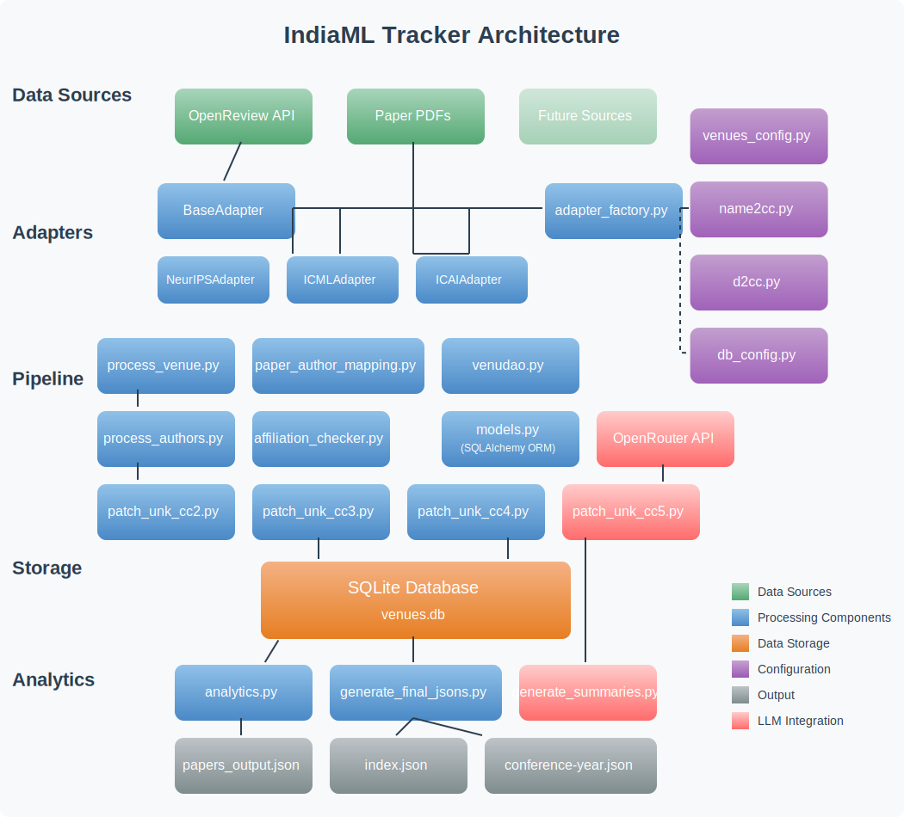
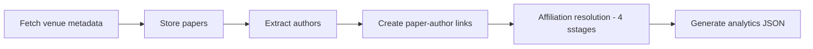

# IndiaML Tracker — Technical Documentation

_Last updated: **17 April 2025**_

---

## Table of Contents

1. [Overview](#overview)
2. [Quick Start](#quick-start)
3. [Research Data Landscape](#research-data-landscape)
4. [System Architecture](#system-architecture)
5. [Data Flow Pipeline](#data-flow-pipeline)
6. [Database Model](#database-model)
7. [Design Patterns & Key Abstractions](#design-patterns--key-abstractions)
8. [Configuration](#configuration)
9. [Extending IndiaML Tracker](#extending-indiaml-tracker)
10. [Analytics & Front‑End](#analytics--front-end)
11. [Deployment & Operations](#deployment--operations)
12. [Testing & Continuous Integration](#testing--continuous-integration)
13. [Troubleshooting & FAQ](#troubleshooting--faq)
14. [Changelog](#changelog)

---

## Overview

**IndiaML Tracker** aggregates and analyses publications from flagship machine‑learning venues to spotlight India’s scientific contributions. It ingests conference metadata (currently via **OpenReview**), resolves author affiliations, persists enriched records in a relational store, and surfaces insights through a lightweight analytics UI.

### Core Objectives

| Goal | Description |
| --- | --- |
| Comprehensive Coverage | Track NeurIPS, ICML, ICLR, and any OpenReview‑hosted venue. |
| Precise Affiliation Mapping | Multi‑stage resolution combining domain heuristics, curated maps, and LLM extraction. |
| Insight Generation | Produce structured JSON for interactive dashboards and static reports. |
| Extensibility | Plug‑and‑play adapters enable new data sources with minimal code. |

---

## Quick Start

```bash
# 1 — Install dependencies (Python 3.11+ recommended)
poetry install --with dev

# 2 — Run the full ETL + analytics stack (SQLite by default)
poetry run indiaml run‑pipeline --all

# 3 — Serve the analytics dashboard (SvelteKit)
cd ui && pnpm install && pnpm dev
```

For granular control, see the [Data Flow Pipeline](#data-flow-pipeline) section.

---

## Research Data Landscape

Machine‑learning research follows a predictable cycle (call for papers → submission → review → decision). Platforms like **OpenReview** expose rich, hierarchically‑organised APIs that IndiaML exploits:

* **Conferences** → Years → Tracks → Submissions
* Each submission bundles authors, affiliations, PDFs, and status.

The Tracker’s data model mirrors this hierarchy for lossless ingestion.

---

## System Architecture



1. **Venue Adapters** ― Normalise raw API responses.
2. **ETL Pipeline** ― Four sequenced stages (Venue→Authors→Mapping→Affiliations).
3. **SQLite DB / SQLAlchemy ORM** ― Single‑file store by default; any SQL backend supported.
4. **Analytics Generator** ― Compiles JSON + CSV datasets and LLM‑generated summaries.
5. **Front‑End UI** ― Static assets served via SvelteKit; consumes generated JSON.

---

## Data Flow Pipeline



### Stage Highlights

| Stage | Key Script | Purpose |
| --- | --- | --- |
| Venue Processing | `process_venue.py` | Fetch papers + store base metadata. |
| Author Processing | `process_authors.py` | Create/update author entities. |
| Paper–Author Mapping | `process_paper_author_mapping.py` | Preserve ordering & provisional affiliations. |
| Affiliation Patches 1‑4 | `patch_unk_cc{2..5}.py` | Resolve unknown countries via domains → names → expanded names → LLM. |
| Analytics Generation | `analytics.py` | Emit ready‑to‑serve datasets. |

---

## Database Model

> Default dialect: SQLite; switchable via `DATABASE_URL`.

```text
VenueInfo 1───* Paper *───* PaperAuthor *───1 Author
```

* **VenueInfo** (conference, year, track) – Ensure uniqueness via compound index.
* **Paper** (id, title, status, dates, pdf_url/path, raw_authors).
* **Author** (demographics + identifier links + affiliation history).
* **PaperAuthor** (composite PK, author ordering, resolved affiliation snapshot).

---

## Design Patterns & Key Abstractions

| Pattern | Location | Rationale |
| --- | --- | --- |
| **Adapter** | `venue_adapters/*` | Uniform interface over heterogeneous APIs. |
| **Factory** | `venue_adapters/adapter_factory.py` | Decouples adapter selection from caller. |
| **Repository** | `venue/venudao.py` | Isolates persistence logic; facilitates mocking. |
| **Pipeline** | `pipeline/*` | Clear staged processing; resumable & parallel‑friendly. |
| **DTOs** | `models/dto.py` | Schema‑agnostic data carriers between layers. |

---

## Configuration

All config lives under `indiaml/config/` and uses simple Python objects — no YAML required.

```python
# venues_config.py
VenueConfig(
    conference="NeurIPS",
    year=2024,
    track="Conference",
    source_adapter="openreview",
    source_id="NeurIPS.cc/2024/Conference",
    adapter_class="NeurIPSAdapter",
)
```

Maps for affiliation resolution:

* **`name2cc.py`** — institution → ISO country code.
* **`d2cc.py`** — domain → ISO country code.

---

## Extending IndiaML Tracker

1. **New Conference on OpenReview** — Add a `VenueConfig`; reuse `OpenReviewAdapter`.
2. **Non‑OpenReview Source** — Implement `BaseAdapter` subclass + register in Factory.
3. **Custom Analytics** — Drop a script in `analytics/` and import the ORM models.

---

## Analytics & Front‑End

The generated `dist/` folder contains:

* `papers.json` — enriched paper records.
* `institutions.json` — per‑institution metrics.
* `summaries.json` — LLM‑curated paper digests (optional).

The UI renders these with the following UX rules:

* **Grouping** — Conference‑year buckets, newest first.
* **Sorting** — `Oral` > `Spotlight` > `Poster`, then title.
* **Author Chips** — Lead authors first, majority (senior) authors second; country flag badge on each.
* **Dynamic Counts** — Live card/tally updates as filters change.

---

## Deployment & Operations

| Environment | Notes |
| --- | --- |
| **Local Dev** | SQLite + `poetry run indiaml run‑pipeline --all`. |
| **CI / GitHub Actions** | Runs lint, unit tests, and nightly pipeline on push to `main`. |
| **Prod (Docker)** | Use `Dockerfile` in repo root; parameterise volumes and crontab. |

Health checks: `/healthz` endpoint (FastAPI) returns DB connectivity + disk space.

---

## Testing & Continuous Integration

* **Unit** — pytest; `pytest -q` must pass pre‑commit.
* **Integration** — Spin‑up ephemeral SQLite, populate with 10 papers, assert metrics.
* **End‑to‑End** — GitHub Action executes full ETL nightly; artifacts uploaded for manual review.

---

## Troubleshooting & FAQ

| Symptom | Likely Cause | Fix |
| --- | --- | --- |
| `sqlite3.OperationalError: database is locked` | Concurrent writes | Run pipeline stages sequentially or switch to PostgreSQL. |
| LLM patch scripts hang | Missing `OPENROUTER_API_KEY` | Export key env var or skip stage 5. |
| UI shows "No papers found" | `dist/` not regenerated | `poetry run indiaml analytics.generate` then refresh UI. |

---

## Changelog

### 17 April 2025 — UI & Presentation Overhaul (India@ML)

* **Reverse‑chronological grouping** by conference/year.
* **Lead authors first**, majority authors second.
* **Oral > Spotlight > Poster** ordering.
* **Country flags** beside each author.
* **Presentation type badge** on every paper card.
* **Dynamic per‑conference counts** respecting active filters.

---

_License: MIT_

