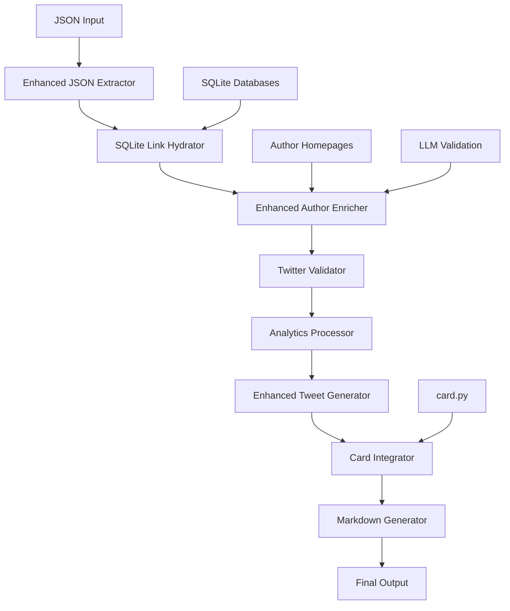

# Enhanced Tweet Generation Pipeline

This document describes the enhanced tweet generation pipeline that implements all the requested improvements for processing paper lists and generating comprehensive tweet threads with visual cards.

## Overview

The enhanced pipeline provides a complete solution for:
1. **Flexible JSON Processing** - Automatic schema detection and adaptation
2. **SQLite Link Hydration** - Extract existing Google Scholar and LinkedIn links
3. **Enhanced Twitter Scraping** - Multi-source Twitter handle discovery
4. **Twitter Validation** - Regex validation and duplicate detection
5. **Enhanced Tweet Generation** - Tweets with validated handles and mentions
6. **Card Generation** - Visual cards for papers with multiple formats

## Architecture



## Pipeline Steps

### Step 1: Initialize
- Validates configuration and input files
- Checks for required JSON and analytics files
- Verifies API keys and database access

### Step 2: Data Extraction
- Extracts conference metadata
- Prepares for JSON processing

### Step 3: Enhanced JSON Processing
- **Automatic Schema Detection**: Detects JSON structure automatically
- **Flexible Field Mapping**: Maps various field naming conventions
- **Author Structure Analysis**: Handles both string arrays and object arrays
- **Indian Author Detection**: Identifies papers with Indian authors

**Supported JSON Schemas:**
- Array of paper objects: `[{paper1}, {paper2}, ...]`
- Object with papers key: `{"papers": [{paper1}, {paper2}]}`
- Single paper object: `{paper}`

### Step 4: SQLite Link Hydration
- **Multi-Database Search**: Queries all available SQLite databases
- **Intelligent Matching**: Uses name and affiliation similarity
- **Link Extraction**: Finds Google Scholar, LinkedIn, homepage links
- **Caching System**: Avoids repeated database queries

**Matching Strategies:**
- Exact name matching
- Fuzzy name matching (first/last name combinations)
- Affiliation-based matching
- Confidence scoring system

### Step 5: Enhanced Author Enrichment
- **Multi-Source Scraping**: Homepage, institutional pages, Google Scholar
- **LLM-Powered Validation**: AI verification of Twitter handles
- **Rate Limiting**: Respectful scraping with proper delays
- **Resume Capability**: Checkpoint system for large datasets

### Step 6: Twitter Handle Validation
- **Regex Validation**: Strict Twitter handle format checking
- **URL Extraction**: Converts Twitter URLs to handles
- **Duplicate Detection**: Removes duplicate handles across authors
- **Reserved Handle Filtering**: Excludes Twitter reserved handles
- **Format Standardization**: Converts all to @handle format

**Validation Rules:**
- Handle format: `@[a-zA-Z0-9_]{1,15}`
- URL patterns: `twitter.com/handle`, `x.com/handle`
- Reserved handles: `home`, `explore`, `settings`, etc.

### Step 7: Analytics Processing
- Processes conference analytics data
- Calculates India-specific metrics
- Generates insights for tweet content

### Step 8: Enhanced Tweet Generation
- **Validated Handle Integration**: Uses only validated Twitter handles
- **Smart Mentions**: Includes author Twitter handles in tweets
- **Enhanced Metadata**: Rich metadata with all social links
- **Quality Indicators**: Highlights spotlight/oral presentations

### Step 9: Card Generation and Integration
- **Multi-Format Support**: PNG, JPG, WebP, PDF
- **Batch Processing**: Efficient generation for all papers
- **Tweet Linking**: Links cards to corresponding tweets
- **PDF Compilation**: Single PDF with all cards

**Card Features:**
- Paper title and authors with flags
- Conference and presentation type
- High-quality visual design
- Multiple output formats

### Step 10: Markdown Generation
- Generates markdown files with enhanced tweet thread
- Includes card references and attachments
- Creates summary documentation

### Step 11: Finalize
- Organizes all output files
- Creates final summary JSON
- Generates pipeline statistics

## Configuration

### Environment Variables
```bash
# Database and Analytics
DATA_DIR=data
ANALYTICS_DIR=ui/indiaml-tracker/public/tracker
OUTPUT_DIR=eda/tweetgen/outputs

# Processing Settings
MAX_CONCURRENT_REQUESTS=3
REQUEST_TIMEOUT=30
RATE_LIMIT_DELAY=2.0

# Tweet Settings
MAX_TWEET_LENGTH=280
MAX_AUTHORS_PER_TWEET=5

# API Keys (Optional)
OPENROUTER_API_KEY=your_key_here
OPENAI_API_KEY=your_key_here
```

### Conference Configuration
The pipeline automatically detects conference files or you can configure them:

```json
{
  "icml-2025": {
    "sqlite_file": "venues-icml-2025-v2.db",
    "analytics_file": "icml-2025-analytics.json",
    "version": "v2"
  }
}
```

## Usage

### Basic Usage
```bash
cd eda/tweetgen
python pipeline/enhanced_pipeline.py icml-2025
```

### Advanced Usage
```bash
# Force restart from beginning
python pipeline/enhanced_pipeline.py icml-2025 --force-restart

# Resume from specific step
python pipeline/enhanced_pipeline.py icml-2025 --resume-from twitter_validation
```

## Input Requirements

### JSON File Format
The pipeline accepts various JSON formats. Here are examples:

**Array Format:**
```json
[
  {
    "title": "Paper Title",
    "authors": [
      {
        "name": "Author Name",
        "affiliation": "Institution",
        "country": "IN"
      }
    ]
  }
]
```

**Object Format:**
```json
{
  "papers": [
    {
      "paper_title": "Paper Title",
      "author_list": ["Author 1", "Author 2"]
    }
  ]
}
```

### SQLite Database Schema
Expected tables and columns:
- `authors`: `id`, `full_name`, `email`, `google_scholar_link`, `linkedin`, `homepage`
- `paper_authors`: `author_id`, `affiliation_name`, `affiliation_country`

## Output Structure

```
outputs/
└── icml-2025/
    ├── tweet_thread.json          # Final tweet thread
    ├── tweet_thread.md            # Markdown version
    ├── summary.md                 # Summary document
    ├── pipeline_summary.json      # Pipeline statistics
    ├── cards/                     # Generated cards
    │   ├── png/                   # PNG format cards
    │   ├── jpg/                   # JPG format cards
    │   └── papers_cards.pdf       # PDF compilation
    └── checkpoints/               # Resume checkpoints
        ├── raw_papers.json
        ├── hydrated_authors.json
        ├── validated_authors.json
        └── ...
```

## Key Features

### 1. Schema Flexibility
- Automatically adapts to different JSON structures
- Maps various field naming conventions
- Handles both simple and complex author formats

### 2. Comprehensive Link Hydration
- Searches multiple SQLite databases
- Intelligent author matching algorithms
- Caches results for efficiency

### 3. Robust Twitter Validation
- Strict regex validation
- Duplicate detection and removal
- Reserved handle filtering
- Format standardization

### 4. Enhanced Tweet Generation
- Validated Twitter handle integration
- Rich metadata with all social links
- Quality indicators for papers
- Smart hashtag selection

### 5. Professional Card Generation
- Multiple output formats
- High-quality visual design
- Batch processing efficiency
- PDF compilation

### 6. Resume Capability
- Checkpoint system for all steps
- Resume from any point
- Progress tracking and statistics

## Error Handling

The pipeline includes comprehensive error handling:
- **Validation Errors**: Clear messages for configuration issues
- **Network Errors**: Retry logic with exponential backoff
- **Data Errors**: Graceful handling of malformed data
- **Resume Support**: Continue from last successful checkpoint

## Performance Optimization

- **Concurrent Processing**: Configurable concurrency limits
- **Caching**: Extensive caching to avoid repeated work
- **Checkpointing**: Resume capability for long-running processes
- **Rate Limiting**: Respectful API and scraping limits

## Monitoring and Statistics

The pipeline provides detailed statistics:
- Processing times for each step
- Success/failure rates
- Link discovery statistics
- Twitter validation metrics
- Card generation results

## Troubleshooting

### Common Issues

1. **JSON Schema Not Detected**
   - Check JSON file format
   - Ensure required fields are present
   - Review field mapping configuration

2. **SQLite Hydration Low Match Rate**
   - Verify database file paths
   - Check author name formats
   - Review matching thresholds

3. **Twitter Validation Failures**
   - Check handle format requirements
   - Review reserved handle list
   - Verify URL extraction patterns

4. **Card Generation Errors**
   - Ensure card.py is available
   - Check output directory permissions
   - Verify required dependencies

### Debug Mode
Enable debug logging by setting:
```bash
export PIPELINE_DEBUG=true
```

## Contributing

When adding new features:
1. Follow the modular component design
2. Add comprehensive error handling
3. Include checkpoint support
4. Update documentation
5. Add unit tests

## Dependencies

Core dependencies:
- `aiohttp` - Async HTTP requests
- `beautifulsoup4` - HTML parsing
- `sqlite3` - Database access
- `pathlib` - File system operations
- `difflib` - String similarity matching

Optional dependencies:
- `openai` - LLM validation
- `PIL` - Image processing (for cards)
- `reportlab` - PDF generation

## License

This enhanced pipeline is part of the IndiaML tracker project and follows the same license terms.
